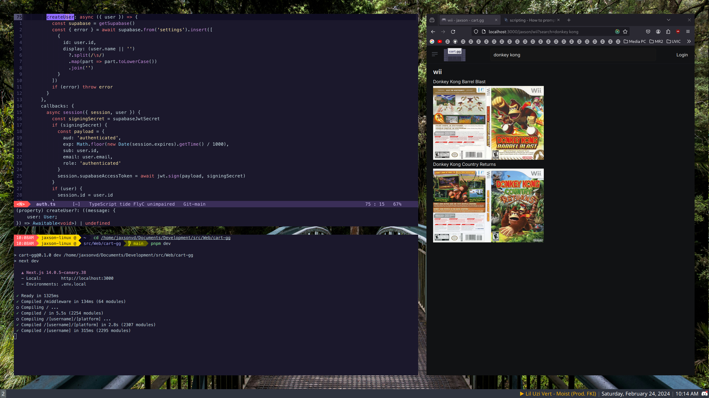

# Dotfiles

## Description

**Custom config files for better workflow on Linux**

Here all my dotfiles which I use on both my Debian and MacOS machines.

**Warning:** The installation script provided is very specific to my needs and does some **dangerous stuff** such as upgrading the kernel, appending to the file system table and configuring graphics drivers.
All commands in `install.sh` as a whole is likely to break/overwrite something in a existing Linux install.  I only use `install.sh` to configure fresh Linux installs.
Make sure you understand what each files does before you use it.  Use at your own risk!

## Overview

**Window Manager**: Sway with wofi

**Editor**: Emacs

**Terminal**: Alacritty / GNU Terminal / iTerm 2 / MacOS Terminal

