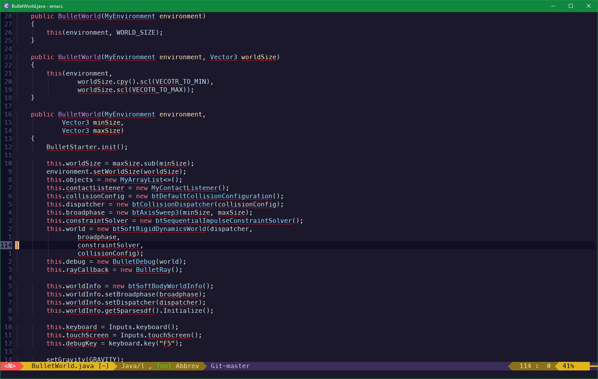
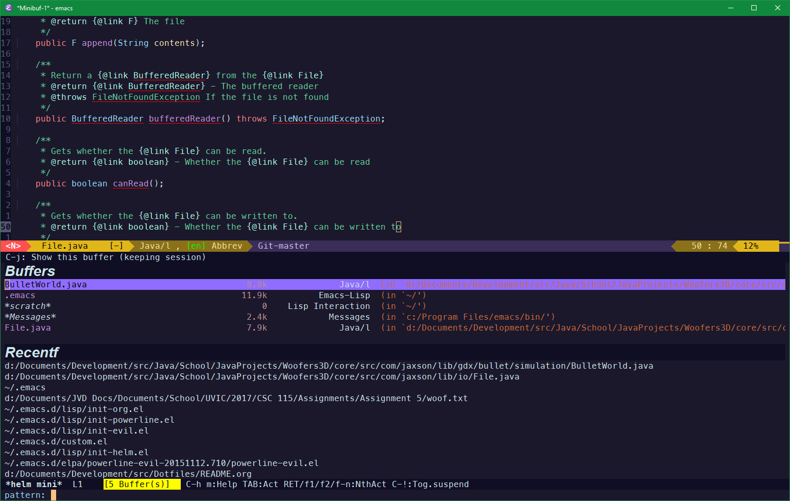
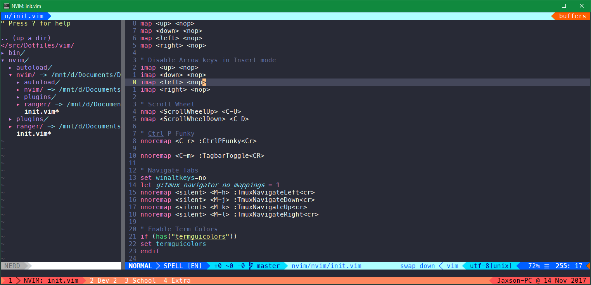
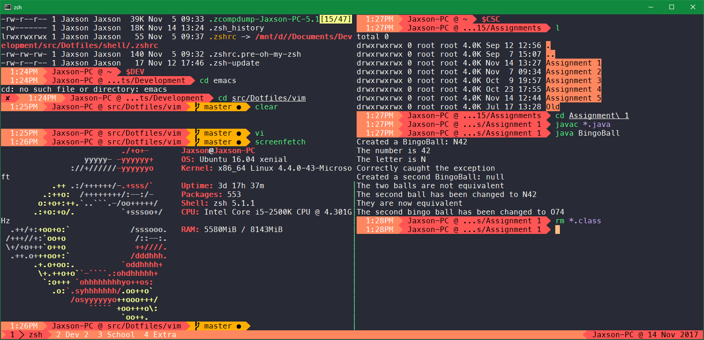

# Dotfiles

## Description

**Custom config files for better workflow on Linux**

Here all my dotfiles which I use on both my desktop and my school laptop.

I run Debian on both machines, however their are specific settings for
Windows Subsystems for Linux in Mintty when I absolutely must use windows for development.

Most config files are symlinked using `install.sh`.

**Warning:** The installation script provided is very specific to my needs and does some **dangerous stuff** such as upgrading the kernel, appending to the file system table and configuring graphics drivers.
All commands in `install.sh` as a whole is likely to break/overwrite something in a existing Linux install.  I only use `install.sh` to configure fresh Linux installs.
Make sure you understand what each files does before you use it.  Use at your own risk!

## Workflow

### Distro

I currently run Debian 9 with GNOME as its super pretty, user-friendly and light.

### Desktop Enviroment

For my main window manager I use i3 for easier mouse-less navigation and nice tilling, ensuring no wasted screen real estate.  Specifically I use the i3-gaps fork which makes things a little less cramped.

For window composting I use Compton to provide nice shadows and transparency.

My application launcher is Rofi which lets me launch and switch apps in a Spotlight like manner.

For a file manger I use Nautilus with Papirus icons (Looks like MacOS).  I was using Nemo for a while but I found Nautilus to be better in terms of the layout.

To keep most apps looking fresh I use the Arc GTK theme which is the best dark theme I have ever come across.

For better Linux fonts I use Infinality to mimic MacOS font styling.  I also use the System San Francisco font as my standard font which looks beautiful when browsing the web.

My notifications are delivered through dunst making each notification customizable and non-intrusive.

### Audio

For managing my audio and volume levels I use pavucontrol which is a really simple audio mixer app under Linux.

### Documents

PDF viewing is done using the default Debian reader Evince.

### Text Editing

Most of my text editing/word-processioning happens in Emacs however for the occasionally last ditch edit I use Neovim when I really screwed something up and am stuck in TTY.  The Org mode plugin in Emacs allows me to export LaTeX, replacing any office suite software.  Emacs also allows me to use a UNIX like shell when I'm on Windows which is always a plus.  However the biggest reason I use Emacs is its modal editing thanks to evil-mode and great git integration with git gutter and Magit.  Composing email with this modal editing is really nice in Emacs with mu4e and mbsync despite the complex setup and broken links.  Emacs' Dired mode also provides a really great way to batch rename files as if it was text.  In short, I really like using Emacs.

### Terminal

I use the standard GNOME Terminal running ZSH as my main shell with TMUX for multiplexing.  Having a native shell beats out the Lisp interrupted shell of Emacs thanks to the great auto-complete and vi mode of ZSH.

### Web

For web browsing I still use Chrome for its syncing features despite the privacy problems.

### Drawing

For tablet drawing on my laptop I use Xournal since it has great stylus support and tracks nicely.

### Multimedia

Any photo manipulation still happens with Photoshop under WINE.  While I feel that GIMP is a capable program I don't think I will ever be able to adapt after using Photoshop for many years.

For 3D modeling and rendering Blender does the job as its supper flexible and fast under Linux (when compared to its Windows port).

### Windows Subsystems for Linux

When I must run Windows, I run Ubuntu under Windows Subsystems for Linux in Mintty.  Mintty supports 256 colors which most Windows terminal emulators are missing.  In my ZSH config it is setup to alias any program in `system32` which means that I can run tons of native Windows commands in a UNIX shell which is neat.

## Usage

I don't recommend that anyone copy and install this whole config (See warning).  However if you insist on doing so simply clone the repo and run `sudo ./install.sh`.

I highly suggest that you cherry pick the elements you want into your own config and build your own config.

While this can be intimidating it will result in a system configured better to your needs.  I hope that this repo will provide a good example of the extreme tweakabilty of Linux.

## Screenshots

### Emacs

My Emacs setup consist of [challenger-deep](https://github.com/MaxSt/challenger-deep) as a theme with a custom [Powerline](https://github.com/milkypostman/powerline).
Emacs setup also heavly relies on [Helm](https://github.com/emacs-helm/helm)

### Neovim

Neovim config uses [dracula-vim](https://github.com/dracula/vim).
Airline theme is **light** from [airline-themes](https://github.com/vim-airline/vim-airline-themes).

### Mintty

Mintty uses [dracula-mintty](https://github.com/dracula/mintty) for its color definitions.

### Tmux

Tmux uses a modified version of [tmux-airline-dracula](https://github.com/sei40kr/tmux-airline-dracula) named **wracula** which matches **BASH** and **ZSH**.

### BASH and ZSH

This config contains a modified versions of both [agnoster-zsh-theme](https://github.com/agnoster/agnoster-zsh-theme) and [agnoster-bash](https://gist.github.com/kruton/8345450) dubbed *wagnoster* for **BASH** and **ZSH**.
LS Color are tweaked version of **dircolors.ansi-dark** from [Solarized Color Theme for GNU](https://github.com/seebi/dircolors-solarized).
ZSH addtionaly uses [zsh-syntax-highlighting](https://github.com/zsh-users/zsh-syntax-highlighting) package.
